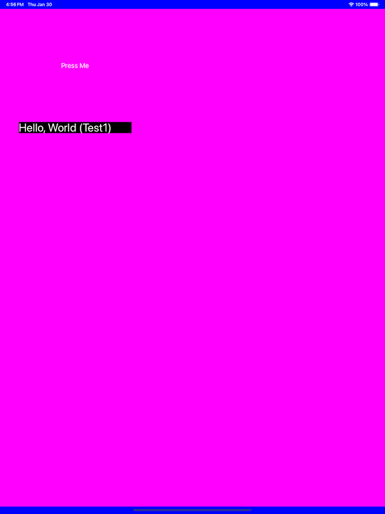

A Very Simple IOS App.
======================

This project builds an IOS app that has a button and a label. The button
action hides/shows the label. The project is intended as a possible
starting template for ObjectiveC/C++ and C++ apps on IOS. The project
only uses a storyboard for the app launch screen (which should only
display for a very brief time anyway). The project demonstrates how
to build views, buttons, labels and so forth programmatically, how to
connect actions (event handlers), how to access the application documents
directory, resources, and data directory, and so forth.

The main approach for this project is to strictly use the command-line
to configure, build, and install the app.

This is not an XCode project, per se. Instead
the project uses a standard configure/Make process to manage all
of the steps. The configure and Makefile scripts are written in
an extremely straightforward manner. The Makefile is responsible for actually running
CMake. CMake in turn knows how to generate an XCode project, which
is placed inside a temporary build directory. The Makefile then
knows how to use xcodebuild to compile and bundle the app, and
install it on the simulator.

For more details on building, etc. see

[Configure](CONFIGURE.md)

[Workflow](WORKFLOW.md)

Currently this app is limited to running on the simulator. Installing on
an actual IOS device requires an Apple developer account etc.

This is a screenshot of the app running on the simulator:

## Prerequisites:

  * Familiarity with shell scripting.
  * Limited familiarity with Make scripts.
  * A text editor.
  * XCode and XCode command-line utilities.
  * CMake
  * Git
  * (recommended) Python

## TO DO:

  * Document the configure process in more detail.

  * Document the app code

    * main, AppDelegate, ViewController
    * cns.h, cns.cc
    * ctest.h ctest.cc

  * Document the CMake scripts.

  * Sometimes the simulator launches but nothing shows
    up on the screen. Clicking on the icon in the taskbar
    may launch it. 

  * Get the log file from the simulator.

  * App versioning. There is a APP_VERSION setting in the
    configure script, which sets the variable for the
    cmake process. Need to figure out how the code can
    get this variable. CMake could generate a file
    `version.h` to be placed in the source tree.

  * Add a screenshot.

  * Work on configuring/building/installing app to real devices.

  * Packaging for app store.

